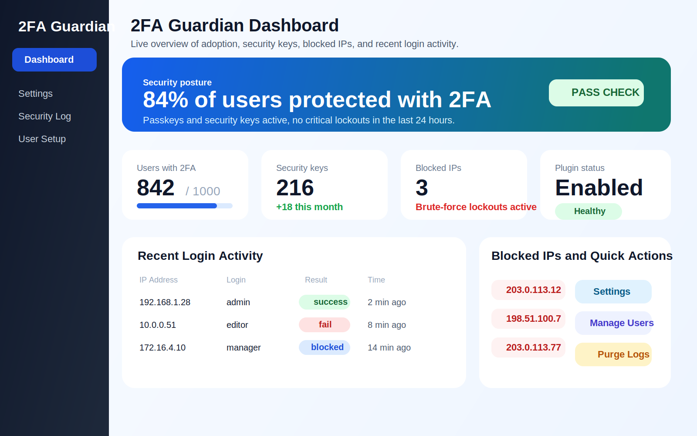
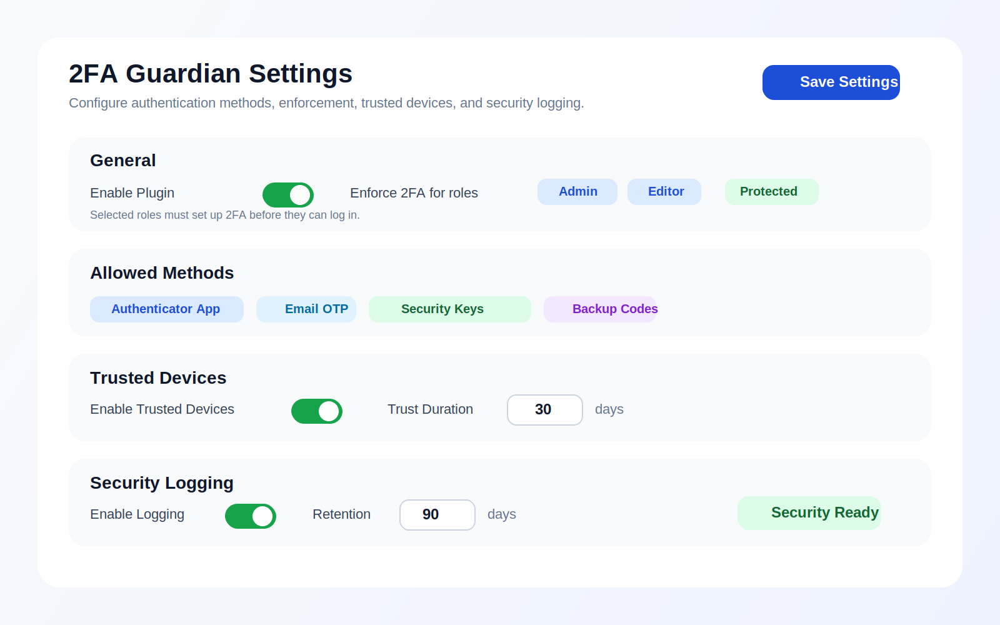

# 2FA Guardian


[](https://github.com/ithubdeveloper/wp-2fa-guardian/actions/workflows/plugin-checks.yml)
[](https://github.com/ithubdeveloper/wp-2fa-guardian/actions/workflows/phpunit.yml)


Two-factor authentication for WordPress with TOTP, email OTP, WebAuthn security keys, backup codes, trusted devices, and login protection.

## Why Trust This Plugin

2FA Guardian is built around local-first authentication data, multiple recovery paths, and repeatable release checks. The repository includes automated syntax checks, packaging validation, and WordPress PHPUnit smoke tests so changes are verified before release.

## Plugin Details

- Plugin slug: `wp-2fa-guardian`
- Version: `1.1.0`
- Requires WordPress: `6.0+`
- Requires PHP: `8.0+`
- Author: [IT Hub Developer](https://github.com/ithubdeveloper)
- Repository: [ithubdeveloper/wp-2fa-guardian](https://github.com/ithubdeveloper/wp-2fa-guardian)
- License: [GPL-2.0-or-later](https://www.gnu.org/licenses/gpl-2.0.html)
- Install modes: Composer from GitHub or standalone ZIP upload

## Features

- Authenticator app support using TOTP
- Email one-time codes
- WebAuthn and passkey support for supported browsers and devices
- Backup recovery codes
- Trusted devices
- Login attempt logging and brute-force lockouts
- Per-role enforcement settings
- Per-user reset tools for administrators

## Quality Signals

- Supports modern passkeys and WebAuthn security keys
- Stores authentication data inside WordPress rather than relying on third-party SaaS services
- Includes backup codes and trusted devices for safer recovery flows
- Uses GitHub Actions for PHP linting, JS checks, packaging checks, and WordPress PHPUnit smoke tests
- Publishes from a versioned Git repository with transparent change history

## Installation

### Install with Composer from GitHub

Use a VCS repository entry in the WordPress project that will consume the plugin. The root project should already support WordPress plugin installers, typically via `composer/installers`.

```json
{
  "repositories": [
    {
      "type": "vcs",
      "url": "git@github.com:ithubdeveloper/wp-2fa-guardian.git"
    }
  ],
  "require": {
    "ithubdeveloper/wp-2fa-guardian": "dev-main"
  }
}
```

If your project uses Composer installers, the plugin will install to your WordPress plugins directory as `wp-2fa-guardian`.

### Install as a Standalone Plugin ZIP

1. Upload the `wp-2fa-guardian` folder to the `/wp-content/plugins/` directory.
2. Activate the plugin through the Plugins screen in WordPress.
3. Go to `2FA Guardian > Settings` to configure allowed methods and enforcement.
4. Users can configure their methods from their profile area or from the dedicated setup flow when 2FA is required at login.

You can also download a release ZIP from the GitHub Releases page once published.

## Frequently Asked Questions

### Which 2FA methods are supported?

The plugin supports TOTP authenticator apps, email OTP, WebAuthn security keys and passkeys, and backup codes.

### Can I enforce 2FA for some roles only?

Yes. Administrators can choose which roles must complete 2FA setup before they can continue logging in.

### Does the plugin send any data to third parties?

The plugin stores authentication data locally in WordPress. During TOTP setup it can request a QR image from `api.qrserver.com` for convenience. The displayed QR URL can be changed or disabled with the `guardian_totp_qr_url` filter.

### What happens if a user loses access to their device?

Users can use backup codes if they have generated them. Administrators can also reset a user's 2FA configuration.

### Does this plugin require Composer?

No. The plugin does not require Composer to run.

## Screenshots

### Dashboard Overview



### Settings Screen



### Login Verification


## Changelog

### 1.1.0

- Hardened login and WebAuthn flows
- Fixed email OTP expiry and refresh handling
- Added a dedicated required-setup flow that reuses the profile setup UI
- Repaired active-method fallback when security keys are removed
- Removed external font loading from the login screen
- Improved package metadata and release readiness for WordPress.org

### 1.0.0

- Initial release

## Upgrade Notice

### 1.1.0

Updates the 2FA flow, WebAuthn handling, and package metadata for a WordPress.org-ready release.
